# StreamTV KMP

**One shared `StateFlow`, two native user interfaces.**

StreamTV KMP is a mobile streaming client built as a Kotlin Multiplatform project. The sharing
boundary stops at the feature ViewModels: everything below them — domain, data, mapping, retry,
paging, optimistic interaction state — is one Kotlin implementation; everything above them is
written twice, natively.

- **Android** is XML and `RecyclerView`, with playback through the sibling `android_stream_player`.
- **iOS** is SwiftUI and `Observation`, with playback through `AVPlayer` and `AVPictureInPicture`.
- **`shared`** owns Home, short and story models, repository contracts, deterministic fixtures,
  Koin wiring and the Ktor boundary.

Neither UI reconstructs a domain rule, and no shared file imports an `Activity`, a SwiftUI view,
Media3 or AVFoundation.

> Every Android image and GIF below is captured automatically from an emulator by
> [`tools/capture_media.py`](tools/capture_media.py). See
> [**How to update these images**](updateReadme.md) before replacing any of them.

---

## What this is built with

| | |
|---|---|
| **Kotlin Multiplatform** | `shared` compiles to an Android library and an iOS static framework |
| **Shared state** | One `StateFlow<XxxUiState>` per screen owner — `HomeViewModel`, `ShortViewModel`, `StoryGroupViewModel` |
| **Dependency injection** | Koin — `startKoinForAndroid` from `Application`, `startKoinForIos` before the first Store |
| **Networking** | Ktor behind `StreamTvApiClient` — OkHttp on Android, Darwin/`NSURLSession` on iOS |
| **Android UI** | XML, `RecyclerView`, `ViewPager2`, Material 3 · compileSdk 37 · minSdk 26 |
| **Android playback** | [`android_stream_player`](../android_stream_player) over Media3, resolved through a Gradle composite build |
| **iOS UI** | SwiftUI, `@Published` stores bridging the shared `StateFlow` |
| **iOS playback** | `AVPlayer` with a periodic time observer, `AVPictureInPictureController` |

### How to read the screenshot tables

Every screen below is shown in a two-column table, because the two columns *are* the argument: the
same shared state, rendered by two independent native UIs.

- **Android** — captured automatically by `tools/capture_media.py` over `adb`. Reproducible.
- **iOS** — recorded from a simulator while a person performs the gesture, because `xcrun simctl`
  can record a simulator but cannot touch one.

Every file the tool writes carries a platform suffix, so the matching `-ios` file can be dropped in
beside the `-android` one without renaming anything. An empty iOS cell names the exact file it is
waiting for, and says why it is still empty: two of them — landscape fullscreen and Picture in
Picture — cannot come from a simulator at all, because nothing in `simctl` rotates one and
`AVPictureInPictureController` reports itself unsupported there.

---

## Contents

| | |
|---|---|
| [1. The sharing boundary](#1-the-sharing-boundary) | Where the shared code stops and native begins |
| [2. Home](#2-home) | Stories rail, featured carousel, ten section view types |
| [3. Stories](#3-stories) | Segmented progress, reactions, hold to pause |
| [4. The short feed](#4-the-short-feed) | Paged 9:16 playback and the action rail |
| [5. The player](#5-the-player) | Portrait VOD detail, landscape fullscreen, settings |
| [6. The floating mini player](#6-the-floating-mini-player) | Drag to shrink, park in a corner, tap to restore |
| [7. Picture in Picture](#7-picture-in-picture) | The system window, and why it is not the mini player |
| [8. Reproducing these captures](#8-reproducing-these-captures) | `tools/capture_media.py` |
| [Technical reference](#technical-reference) | Project map, Koin, Ktor, build |

---

## 1. The sharing boundary

The boundary is drawn at the ViewModel, not at the view. That is the whole design decision: it
shares every rule worth sharing and shares no pixel.

```text
                    ┌──────────────────────────────┐   ┌──────────────────────────────┐
   native UI        │ Android — XML / RecyclerView │   │ iOS — SwiftUI / Observation  │
                    │ MainActivity                 │   │ MainTabView                  │
                    │  └ HomeTabFragment           │   │  └ HomeTabView               │
                    │     └ HomeFragment           │   │     └ HomeView               │
                    │        └ section adapters    │   │        └ section views       │
                    └──────────────┬───────────────┘   └───────────────┬──────────────┘
                                   │                                   │
                                   └─────────────┬─────────────────────┘
                                                 ▼
                    ┌─────────────────────────────────────────────────────────────────┐
   shared           │  presentation   HomeViewModel → StateFlow<HomeUiState>           │
   (commonMain)     │                 ShortViewModel, StoryGroupViewModel              │
                    │  domain         HomeRepository, ShortRepository, typed models    │
                    │  data           HomeDummyDataSource, mappers                     │
                    │  core/network   StreamTvApiClient (Ktor)                         │
                    │  di             Koin graph + platform bootstrap                  │
                    └───────────────┬─────────────────────────────┬───────────────────┘
                                    │ expect/actual               │
                    ┌───────────────▼──────────┐   ┌──────────────▼───────────────────┐
   platform         │ androidMain — OkHttp     │   │ iosMain — Darwin / NSURLSession  │
                    └──────────────────────────┘   └──────────────────────────────────┘

   playback stays native on both sides and never crosses the boundary:
     Android  StreamTvPlayerManager → Media3/ExoPlayer      iOS  StreamPlayer → AVPlayer
```

Two consequences are worth stating, because they are what the rest of this README shows:

- **The UI models are deliberately flat.** `HomeContentUiModel` and `ShortItemUiModel` carry
  strings, booleans and counts, not sealed hierarchies, because they have to stay ergonomic in
  Swift. The typed `Video` / `Series` / `Channel` / `ShortVideo` variants live in the domain layer
  and never leave it.
- **Decoder state never crosses.** Position, buffering, track selection, surface lifecycle and
  rotation are owned by each platform. What crosses is a URL and some metadata.

---

## 2. Home

`HomeFragment` and `HomeView` are thin on purpose: they collect one `StateFlow<HomeUiState>`,
render it, and handle nothing else. `HomeTabFragment` / `HomeTabView` own the brand bar, search,
notifications, profile and the category row above them.

<table>
<tr><th width="50%">Android</th><th width="50%">iOS</th></tr>
<tr>
<td>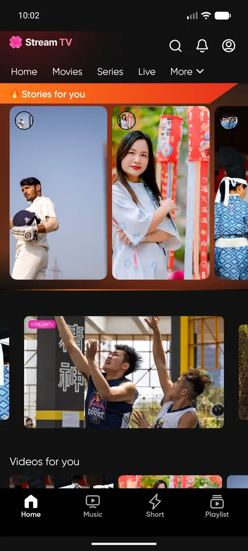</td>
<td>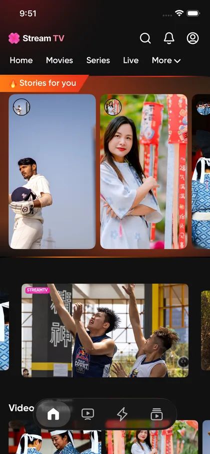</td>
</tr>
<tr><td colspan="2"><em>The same section list, the same order, the same fixture — and two completely separate rendering stacks. The stories rail is the first section, not a chrome element: it arrives in <code>HomeUiState</code> like every other row.</em></td></tr>
</table>

Ten section view types share one vertical list. Each section owns a title, a `viewType` and its own
horizontal list of content; the section adapter resolves the view type to a dedicated holder rather
than branching inside one.

<table>
<tr><th width="50%">Android</th><th width="50%">iOS</th></tr>
<tr>
<td></td>
<td>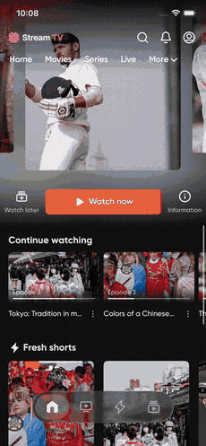</td>
</tr>
<tr><td colspan="2"><em>Scrolling past the featured carousel, the ranked <strong>Popular videos</strong> rail, the series rail with episode badges, live channels, the portrait spotlight, <strong>Continue watching</strong> with its progress bars, and the mini-app chips.</em></td></tr>
<tr>
<td>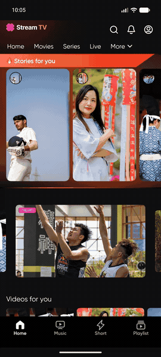</td>
<td>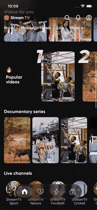</td>
</tr>
<tr><td colspan="2"><em>The category row collapses as the feed scrolls and comes back at the top. The feed reports its scroll offset upward to the tab shell — the shell owns the chrome, the feed owns the content, and neither reaches into the other.</em></td></tr>
</table>

Selecting an item is resolved from the item itself, not from the row it was pressed in: a story
opens the story viewer, a short opens the short feed positioned on that item, anything else opens
the player.

---

## 3. Stories

`StoryGroupFragment` and `StoryGroupView` resolve the selected item to every story from the same
provider. The shared `StoryGroupViewModel` owns only the previous/next index; segmented progress,
playback and the reaction animation are native.

<table>
<tr><th width="50%">Android</th><th width="50%">iOS</th></tr>
<tr>
<td>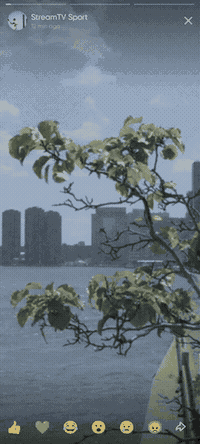</td>
<td>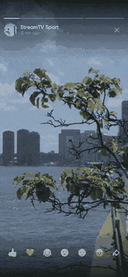</td>
</tr>
<tr><td colspan="2"><em>A reaction launches a copy of its own emoji from the button it was tapped on, rises five button heights and fades over 800 ms. Tapping the right half advances; the segment bar tracks real playback position, so it is the player that drives the bar rather than a timer next to it.</em></td></tr>
<tr>
<td>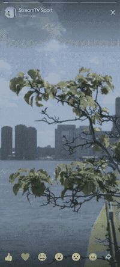</td>
<td>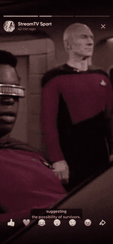</td>
</tr>
<tr><td colspan="2"><em>Holding the frame pauses playback and the segment stops advancing with it. Releasing resumes only if it was playing when the hold began — a story that was already paused stays paused.</em></td></tr>
</table>

Android pools the reaction views (`Pools.SynchronizedPool`, bounded at 50) and cancels the burst
coroutine on pause; iOS models the same fifty in-flight reactions in `StoryReactionStore` and
cancels them when the viewer backgrounds or the view disappears. Same behaviour, same bound, two
implementations — because the animation itself is a platform concern.

---

## 4. The short feed

A full-height page at a time, one active player. Android snaps a vertical `RecyclerView` with
`PagerSnapHelper` and lends engines from a three-slot `StreamTvPlayerPool`; iOS pages a SwiftUI
scroll view and unloads the `AVPlayer` item of any page that stops being active.

<table>
<tr><th width="50%">Android</th><th width="50%">iOS</th></tr>
<tr>
<td>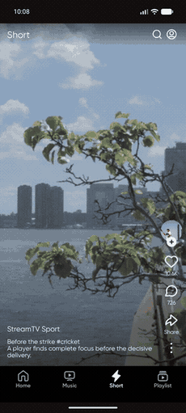</td>
<td>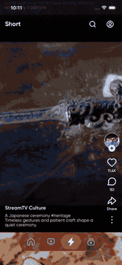</td>
</tr>
<tr><td colspan="2"><em>Changing pages pauses and rewinds every other slot; re-entering a page you have already seen reuses its warm buffer instead of starting a new load.</em></td></tr>
<tr>
<td>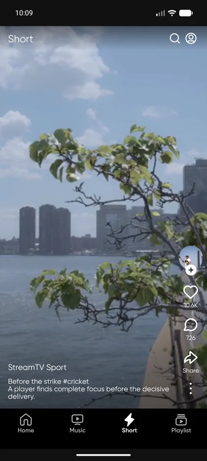</td>
<td>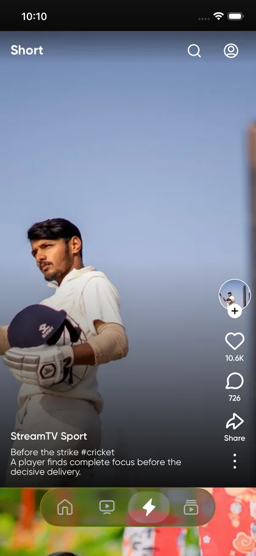</td>
</tr>
<tr><td colspan="2"><em>The action rail: a provider avatar with the follow control overlaid on its bottom edge, then Like, Comment, Share and More. Follow is provider-wide, so following here changes every page from the same provider.</em></td></tr>
<tr>
<td></td>
<td>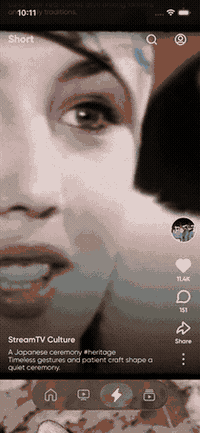</td>
</tr>
<tr><td colspan="2"><em>Like and follow apply optimistically in shared state, which is why both platforms show the same count without either of them computing it. The follow check stays visible for one second before the affordance hides. Tapping the video pauses it and scales in the centre indicator.</em></td></tr>
</table>

Comments, reports and recommendation writes are explicit API integration points; the local
optimistic state keeps the finished behaviour testable until the endpoint exists.

---

## 5. The player

`PlayerFragment` is an overlay on `MainActivity`, not a separate Activity — that is what lets
playback survive switching tabs. It owns one `StreamTvPlayerManager` and asks the overlay for one
of four presentations: portrait detail, landscape fullscreen, mini, or system Picture in Picture.
`PlayerOverlayStore` is its iOS counterpart.

<table>
<tr><th width="50%">Android</th><th width="50%">iOS</th></tr>
<tr>
<td>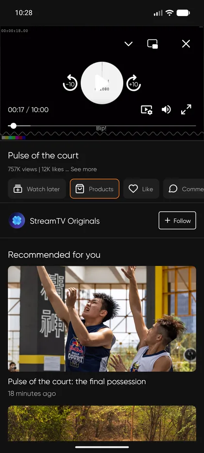</td>
<td>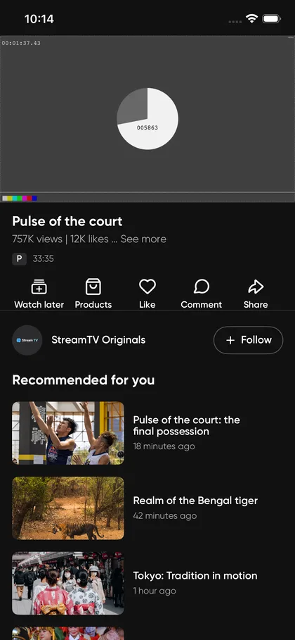</td>
</tr>
<tr><td colspan="2"><em>Portrait detail: a 16:9 player anchored at the top, then the title, the view/like summary, the horizontally scrollable action row, the provider row and the recommendations. There is no top bar above the player — the player card has to start at <code>y = 0</code> because it is what travels away when it shrinks, so close, minimize and PiP live in the controller instead.</em></td></tr>
<tr>
<td>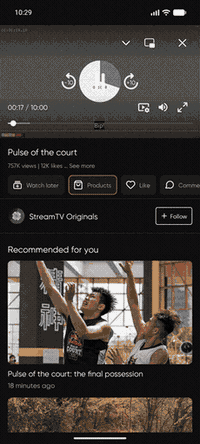</td>
<td>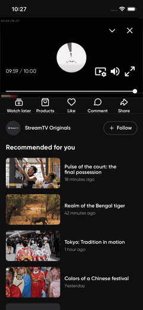</td>
</tr>
<tr><td colspan="2"><em>The detail list scrolls under a player that stays put. The list reserves the player's strip with a 16:9 spacer rather than being laid out below it, because the player is a sibling that floats over the list and will move.</em></td></tr>
<tr>
<td>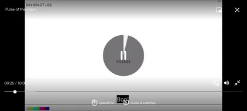</td>
<td align="center"><em>waiting for <code>docs/images/player-fullscreen-ios.webp</code><br>— must be captured on a device or by rotating the simulator by hand; nothing in <code>simctl</code> rotates one</em></td>
</tr>
<tr><td colspan="2"><em>Landscape is fullscreen with the wide controller spacing. The configuration change is handled by the Activity, so the same fragment, the same manager and the same decoder stay alive across the rotation — nothing reloads.</em></td></tr>
<tr>
<td>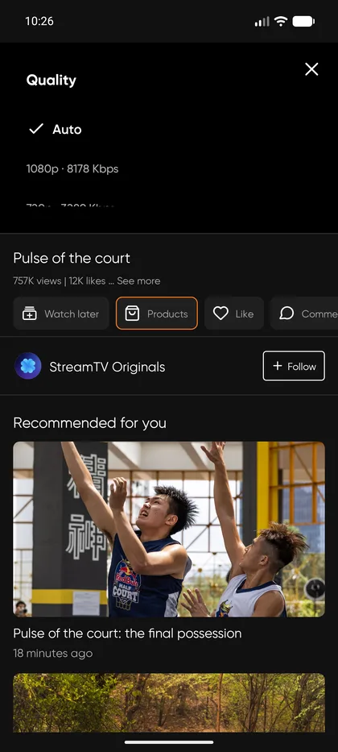</td>
<td>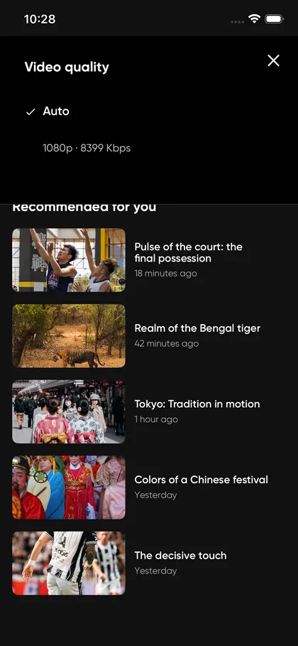</td>
</tr>
<tr><td colspan="2"><em>Quality, speed, audio and subtitles, each resolved from the engine's real track list. A category with nothing to choose between is not drawn, so this panel is shorter on a stream with one rendition — that is the design, not a missing row.</em></td></tr>
</table>

Every control maps to one engine operation and creates no duplicate state:

| UI action | `android_stream_player` operation |
| --- | --- |
| Initial load, retry, or replacing the item | `loadAndPlay(uri)` |
| Play or pause, VOD | `togglePlayPause()` |
| Play or pause, live | `togglePlayPauseAtDefaultPosition()` |
| Replay an ended VOD | `replay()` |
| Rewind / forward | `seekBack()` / `seekForward()` |
| Scrub | `seekTo(duration)` |
| Quality, audio, subtitles | `selectVideoTrack` / `selectAudioTrack` / `selectTextTrack` |

Back is layered rather than uniform: close the settings panel, else leave landscape for portrait,
else minimize a portrait detail player, else close an already minimized one.

---

## 6. The floating mini player

Dragging the player downward shrinks it into a card that can be dragged anywhere, pinched, and
parked in a corner. The card is a one-to-one port of `ottclouds-android`'s Compose
`NewMinimizableView` into XML Views, with the same arithmetic in `MinimizableViewState`.

<table>
<tr><th width="50%">Android</th><th width="50%">iOS</th></tr>
<tr>
<td>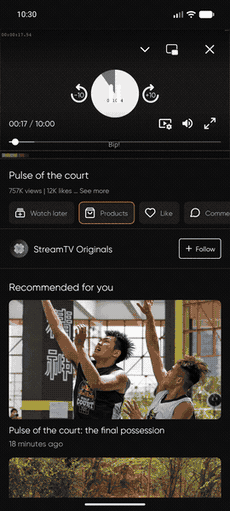</td>
<td>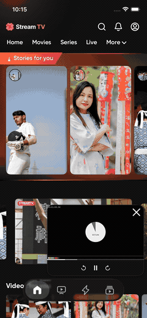</td>
</tr>
<tr><td colspan="2"><em>The card follows the finger while the detail behind it fades, and the shrink completes on release <strong>at whatever depth the drag reached</strong> — there is no distance or velocity threshold. Tapping the card restores the detail screen; the transport strip under it is excluded from that tap detector, so rewind and play/pause still work in mini.</em></td></tr>
<tr>
<td>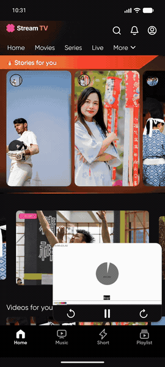</td>
<td>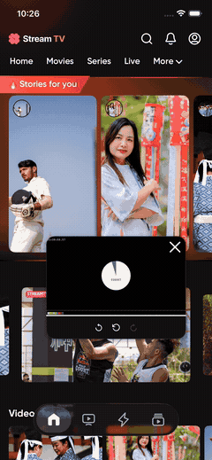</td>
</tr>
<tr><td colspan="2"><em>Released anywhere, the card settles into the nearest corner and keeps the same 16 dp gap from both window edges. The bottom-navigation height is <strong>measured</strong> rather than assumed, because that bar is <code>GONE</code> while the player is expanded and a <code>GONE</code> view measures zero.</em></td></tr>
</table>

While minimized, the overlay container stays window-sized — the card travels the whole window — but
it paints no background and nothing outside the card is clickable, so a touch beside the mini player
falls through to the destination behind it. That is why the bottom navigation and the feed stay
usable underneath.

Three things differ from the Compose reference, and only because the host is a `ViewGroup`:

1. **The padded card and the scaled content are two views.** Padding lives inside a view's bounds,
   so scaling one view would scale its border gap with it; Compose gets this free from modifier
   order.
2. **No coroutine scope.** The composable queues updates on `AndroidUiDispatcher` and has to reason
   about FIFO ordering; `MinimizableView` calls the state directly from the touch handler on the
   main thread, so there is no queue to get wrong.
3. **Touches are hit-tested against the card.** The composable's `pointerInput` sits on the player
   column alone; this view spans the whole overlay, so without an explicit hit test the list behind
   could not be scrolled.

---

## 7. Picture in Picture

The mini player and system Picture in Picture are deliberately separate features, and the
difference is which process is in front.

<table>
<tr><th width="50%">Android</th><th width="50%">iOS</th></tr>
<tr>
<td>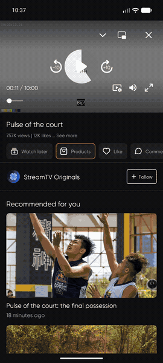</td>
<td align="center"><em>waiting for <code>docs/images/player-pip-ios.gif</code><br>— <code>AVPictureInPictureController.isPictureInPictureSupported()</code> is <code>false</code> in the Simulator, so the app correctly draws no PiP action there; this cell needs a device</em></td>
</tr>
<tr><td colspan="2"><em>The controller's PiP action hands the surface to the system window and the app goes to the background. The same manager and the same surface stay alive — detail, settings, errors and every app controller are hidden rather than torn down, so coming back restores portrait detail or landscape fullscreen without a reload.</em></td></tr>
</table>

| | Mini player | System Picture in Picture |
|---|---|---|
| Who is foregrounded | the app | the system |
| App chrome | bottom navigation visible, feed usable | app is backgrounded |
| Controls | the app's own transport strip | system-provided PiP chrome |
| Entered by | dragging the player down | the controller's PiP action, or leaving the app while playing |

Android enters with a 16:9 ratio, a source-rect hint and Android 12 seamless/auto-enter parameters;
`onUserLeaveHint` also enters it when the viewer leaves the app while playing. Minimizing or closing
disables auto-enter, so an inactive player cannot reopen PiP later. iOS owns the same transitions
through `AVPictureInPictureController` in `PictureInPictureCoordinator` — `start()` is the
counterpart of `enterPlayerPictureInPicture`, and its delegate callbacks are the counterpart of
`onPictureInPictureModeChanged`.

---

## 8. Reproducing these captures

```bash
adb devices                      # exactly one device
./gradlew :androidApp:assembleDebug
adb install -r androidApp/build/outputs/apk/debug/androidApp-debug.apk

python3 tools/capture_media.py list          # every capture and its kind
python3 tools/capture_media.py gif player-mini
python3 tools/capture_media.py shot player-detail
python3 tools/capture_media.py all           # ~15 minutes
python3 tools/capture_media.py ios player-mini   # records the iOS column by hand
```

The tool targets by accessibility node rather than by pixel, cold-starts the app before every
capture, and writes `docs/images/<name>-android.{webp,gif}`.

**Read [`updateReadme.md`](updateReadme.md) before re-capturing anything.** It maps each source
file to the captures that must be re-run, records which fixture each demo uses, and documents the
two traps that produce valid files of the wrong thing: an emulator decoder that corrupts H.264
Main and High profiles into coloured noise while still reporting healthy playback, and a controller
that auto-hides only while `isPlaying` is true.

---

# Technical reference

## Project map

```text
kmp-stream-tv/
├── shared/src/
│   ├── commonMain/           # Domain, data, shared ViewModels, Koin, Ktor boundary
│   ├── androidMain/          # OkHttp Ktor engine and Android Koin bootstrap
│   └── iosMain/              # Darwin Ktor engine and iOS Koin bootstrap
├── androidApp/src/main/
│   ├── kotlin/.../core/ui/recyclerview/   # RecyclerView support primitives
│   ├── kotlin/.../feature/home/           # Home tab/fragment, category bar, adapters, holders
│   ├── kotlin/.../feature/short/          # Paged vertical feed and pooled playback
│   ├── kotlin/.../feature/story/          # Grouped story viewer and progress controls
│   ├── kotlin/.../feature/player/         # PlayerFragment, PlayerView, mini player, PiP
│   ├── kotlin/.../feature/placeholder/    # Ready-to-replace destination fragments
│   └── res/layout/                        # XML layouts
├── iosApp/iosApp/
│   ├── App/                  # Persistent app-level destinations
│   ├── Feature/Home/         # Store, category shell, feed, section renderers
│   ├── Feature/Short/        # Vertical short feed and action sheets
│   ├── Feature/Story/        # Grouped story viewer and reaction store
│   ├── Feature/Player/       # AVPlayer owner, controller, mini container, PiP
│   └── Core/UI/              # Platform-wide visual tokens and remote artwork
├── tools/capture_media.py    # The capture tool behind every Android image above
├── docs/                     # Architecture and integration notes
└── spec/                     # Framework-neutral behavior contracts
```

Visual resources have one source: Android `res/`.
[`scripts/sync_ios_android_assets.py`](scripts/sync_ios_android_assets.py) copies the approved
Gilroy weights and raster artwork and converts Android vector path data into vector-preserving iOS
image sets, so the two shells keep one visual identity without moving any View or SwiftUI concept
across the boundary.

## Android navigation shell

`MainActivity` owns the four-item bottom navigation (Home, Music, Short, Playlist) and keeps
destination fragments alive while switching tabs. The player overlay is excluded from that
hide/show loop, which is what lets mini playback survive a tab change. Music, Playlist and the
non-Home categories are placeholders so a future feature can replace one class without rebuilding
the shell.

See [navigation shell](docs/navigation.md) for ownership and replacement points.

## Koin and Ktor

Koin constructs the shared data sources, repositories, mappers, ViewModels and Ktor client. Feature
ViewModels are factories because each native screen owns its own lifecycle: Android puts the
instance in a `ViewModelStore`, iOS owns it in a feature Store.

Home is deterministic dummy data today, so the HTTP client is isolated behind `StreamTvApiClient`
and a remote data source can be substituted at the Koin binding without touching a ViewModel or a
UI contract.

## Build and test

Requirements: JDK 17+, Android SDK 37, and the sibling `android_stream_player` checkout.

```bash
./gradlew ktlintFormat
./gradlew ktlintCheck
./gradlew :shared:testAndroidHostTest
./gradlew :androidApp:assembleDebug
```

Open `iosApp/iosApp.xcodeproj` in Xcode to build iOS. Configure `TEAM_ID` in
`iosApp/Configuration/Config.xcconfig` for a signed device build.

## Documentation

- [Architecture](docs/architecture.md)
- [Home implementation](docs/home.md)
- [Navigation shell](docs/navigation.md)
- [Player integration](docs/player.md)
- [Short feed and stories](docs/shorts.md)
- [Kotlin code style](docs/code-style.md)
- [How to update the images in this README](updateReadme.md)
- Specs: [home](spec/home.md) · [navigation](spec/navigation.md) · [player](spec/player.md) · [shorts and stories](spec/shorts.md) · [profile](spec/profile.md)
