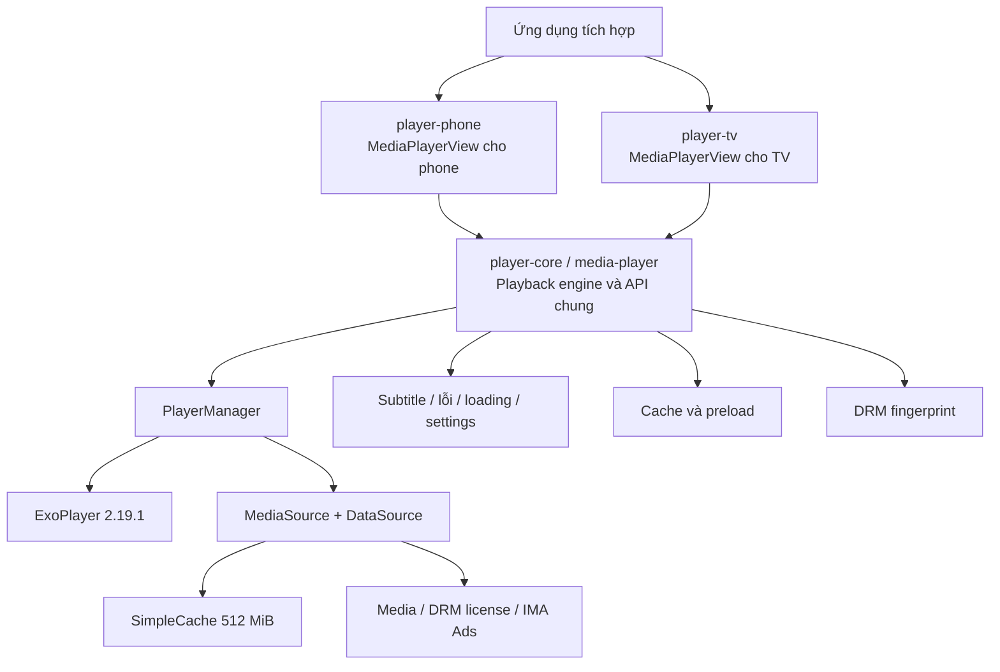

# OnMediaPlayer Android

OnMediaPlayer là bộ thư viện phát video Android viết bằng Kotlin, xây trên **ExoPlayer 2.19.1**. Repository không chứa ứng dụng demo; cả ba module đều là Android Library và được phát hành thành ba Maven artifact riêng.

Các khả năng chính:

- Phát Progressive, DASH, HLS và SmoothStreaming thông qua `DefaultMediaSourceFactory`.
- DRM Widevine, header cho request license và tùy biến parser của response license.
- Đọc, hiển thị và chuyển subtitle/audio/video track có trong manifest hoặc media stream.
- Player cho phone với controller, fullscreen, Picture-in-Picture (PiP), xoay màn hình và scrubbing thumbnail.
- Player cho Android TV với điều khiển D-pad và các vùng action tùy biến.
- Cache LRU, preload một phần video, URL dự phòng và tự retry.
- Google IMA Ads, listener theo dõi playback, UI lỗi tùy biến và DRM fingerprint/watermark.

## Yêu cầu kỹ thuật

| Thành phần | Phiên bản/cấu hình hiện tại |
| --- | --- |
| Min SDK | 26 |
| Compile/Target SDK | 33 |
| Kotlin | 1.7.20 |
| Android Gradle Plugin | 7.3.1 |
| Gradle Wrapper | 7.4 |
| ExoPlayer | 2.19.1, package `com.google.android.exoplayer2` |
| Java bytecode | Java 8 |

## Kiến trúc tổng thể



Luồng phát chính:

1. App gọi `MediaPlayerView.prepareAndPlay(...)`.
2. Core lưu URL chính, URL dự phòng, `DrmOption` và `PlayingParams`.
3. `PlayerManager` tạo `ExoPlayer` theo `PlayerOptions`, sau đó tạo `MediaSource` dùng network hoặc cache.
4. Nếu có DRM, một `DefaultDrmSessionManager` Widevine và `DefaultMediaDrmCallback` được gắn vào source. Nếu có ads, `ImaAdsLoader` được gắn vào source.
5. ExoPlayer phát lên `SurfaceView` mặc định hoặc `TextureView`; `MediaPlayerView` chuyển state, track, cue và error thành UI/callback của SDK.
6. Khi phát một view, `PlayerViewManager` tự pause các player view khác trong cùng Activity để tránh nhiều video cùng phát.

### Ba module

| Thư mục | Maven artifact | View dùng khi tích hợp | Trách nhiệm |
| --- | --- | --- | --- |
| `media-player/` | `io.teragroup:player-core` | `io.teragroup.player.core.MediaPlayerView` | Playback engine dùng chung, state/lifecycle, DRM, track, subtitle renderer, cache, preload, ads, fingerprint, error và model. Core không tạo controller cụ thể. |
| `phone/` | `io.teragroup:player-phone` | `io.teragroup.player.MediaPlayerView` | Kế thừa core và bổ sung controller trên/giữa/dưới, fullscreen, PiP, auto-rotation, seek/scrubbing, volume, tốc độ và menu track. |
| `tv/` | `io.teragroup:player-tv` | `io.teragroup.player.tv.MediaPlayerView` | Kế thừa core và bổ sung controller tối ưu cho D-pad, progress, play/pause và các vùng action/title tùy biến. |

Quan hệ dependency là `phone -> media-player <- tv`. Vì API của phone/TV kế thừa trực tiếp class trong core, cấu hình tích hợp an toàn nhất là khai báo `player-core` cùng `player-phone` **hoặc** `player-tv`. Nếu Maven metadata của registry đã giữ dependency bắc cầu thì Gradle có thể tự lấy core, nhưng khai báo tường minh sẽ tránh lỗi thiếu superclass/API khi publication chỉ xuất AAR.

### Các thành phần quan trọng trong `media-player/`

| Thành phần | Vai trò |
| --- | --- |
| `core/MediaPlayerView.kt` | API trung tâm: chuẩn bị media, play/pause/seek/stop/release, lifecycle, state, surface, controller hook, track selection, retry/fallback, ads, subtitle cue và fingerprint. |
| `internal/PlayerManager.kt` | Tạo/configure ExoPlayer, load control, `MediaItem`, data source, ads source và Widevine session. |
| `internal/PlayerViewManager.kt` | Theo dõi các view bằng `WeakReference`; bảo đảm trong một Activity chỉ view vừa gọi `play()` tiếp tục phát. |
| `drm/*`, `internal/drm/*` | Khai báo `DrmOption`, parser response license và thực hiện POST license/provision request. |
| `extension/Player.kt` | Chuyển `Tracks` của ExoPlayer thành model SDK và áp dụng `TrackSelectionOverride` cho subtitle/audio/video. |
| `internal/CacheManager.kt` | Một `SimpleCache` dùng chung, dung lượng 512 MiB, loại dữ liệu theo LRU và bỏ qua cache khi cache lỗi. |
| `VideoPreLoadManager.kt`, `internal/preload/*` | Lập lịch WorkManager để tải trước các segment đầu của DASH/HLS/SmoothStreaming. |
| `internal/view/*` | Subtitle renderer, màn hình lỗi, loading/controller contract và bảng cài đặt video/audio/subtitle/speed. |
| `internal/scrubbing/*` | Đọc VTT sprite metadata, tải/cache sprite ảnh và cắt thumbnail theo vị trí seek. |
| `internal/fingerprint/*` | Đọc user info từ response DRM, polling cấu hình fingerprint, hiển thị mã watermark ở vị trí ngẫu nhiên hoặc chặn user. |
| `model/*` | Cấu hình, state, action, error và model track mà app sử dụng. |

### State và lifecycle

`PlayerState` có năm giá trị:

- `IDLE`: ExoPlayer chưa/không còn có media đã prepare.
- `PREPARING`: đang prepare hoặc buffer.
- `READY`: đã sẵn sàng phát; trạng thái play/pause được báo riêng qua listener.
- `END`: phát hết nội dung.
- `ERROR`: hết URL dự phòng và số lần retry, hoặc gặp lỗi không phục hồi được.

`MediaPlayerView` tự bind với lifecycle của `AppCompatActivity`; nếu context không phải Activity, nó dùng lifecycle của process. Khi app ra background, player đang chạy sẽ pause và có thể tiếp tục khi resume. Khi view bị detach, hành vi mặc định là `OnDetachAction.STOP`; có thể đổi thành `PAUSE` hoặc `NONE`.

## Cài đặt

Thêm Maven repository đang chứa package của dự án, sau đó chọn artifact phù hợp:

```groovy
dependencies {
    // Engine dùng chung
    implementation "io.teragroup:player-core:1.2.0-SNAPSHOT"

    // Ứng dụng phone/tablet
    implementation "io.teragroup:player-phone:1.2.0-SNAPSHOT"

    // Hoặc ứng dụng Android TV
    // implementation "io.teragroup:player-tv:1.2.0-SNAPSHOT"

    // Nếu chỉ dùng engine nền và tự xây controller thì bỏ artifact phone/TV.
}
```

Nếu làm việc trực tiếp trong repository này, các module đã được khai báo trong `settings.gradle`:

```groovy
implementation project(":media-player")
implementation project(":phone")
// Hoặc thay dòng :phone bằng:
// implementation project(":tv")
```

`player-core` đã khai báo `INTERNET` và `ACCESS_NETWORK_STATE`; manifest merger sẽ đưa các permission này vào app.

## Tích hợp nhanh trên phone

### 1. Thêm view

```xml
<io.teragroup.player.MediaPlayerView
    android:id="@+id/playerView"
    android:layout_width="match_parent"
    android:layout_height="wrap_content"
    app:playerAspectRatio="AR_16_9"
    app:playerControllerType="full"
    app:playerCacheEnable="true"
    app:playerEnableAutoRotation="true"
    app:playerEnablePip="true"
    app:playerHasPlaybackSettingButton="true"
    app:playerMaxVideoResolution="VR_1080P" />
```

`ControllerType.STANDARD` tạo controller giữa và dưới; `FULL` thêm controller trên; `NONE` không tạo controller. Trên TV, mọi giá trị khác `NONE` đều dùng controller TV duy nhất.

### 2. Chuẩn bị và phát

```kotlin
import io.teragroup.player.MediaPlayerView
import io.teragroup.player.model.Attributes
import io.teragroup.player.model.BottomControllerAttributes
import io.teragroup.player.model.ControllerType
import io.teragroup.player.model.PlayerOptions
import io.teragroup.player.model.PlayingParams

val attributes = Attributes(
    title = "Tên nội dung",
    controllerType = ControllerType.FULL,
    playerOptions = PlayerOptions(
        bufferForPlayback = 3,
        playerSeekIncrement = 10,
        isLooping = false,
        cacheEnable = true,
        isMute = false
    ),
    bottomControllerAttributes = BottomControllerAttributes(
        enableFullScreen = true,
        hasPlaybackSettings = true
    ),
    enablePip = true,
    maxNumberRetry = 2
)

playerView.prepareAndPlay(
    url = "https://cdn.example.com/movie/master.m3u8",
    backupUrls = listOf(
        "https://backup.example.com/movie/master.m3u8"
    ),
    isAutoPlay = true,
    attributes = attributes,
    params = PlayingParams(
        hasAds = false,
        contentId = "content-123",
        videoId = "video-123"
    )
)
```

`backupUrls` được thử lần lượt khi playback lỗi và player seek lại vị trí gần nhất. Sau khi hết URL dự phòng, `maxNumberRetry` quyết định số vòng retry lại URL chính.

### 3. Điều khiển và quan sát

| API | Ý nghĩa |
| --- | --- |
| `play(fromStart)` / `pause()` | Tiếp tục hoặc pause; `fromStart = true` seek về default position. |
| `seekTo(positionMs)` | Seek theo mili giây. |
| `stop()` | Pause, stop media hiện tại, che surface và dừng fingerprint. |
| `release()` | Stop, giải phóng ExoPlayer, tách ads loader và dừng fingerprint. |
| `isPrepared()` / `isPlaying()` | Kiểm tra player đã prepare hoặc đang phát. |
| `currentPosition`, `bufferedPosition`, `duration` | Thời gian theo mili giây. |
| `resolution` | Độ phân giải video hiện tại quy về `VideoResolution`. |
| `playerState`, `playbackError` | State và lỗi đã chuẩn hóa của SDK. |
| `showSubtitle(track?)` | Chọn subtitle; truyền `null` để tắt. |
| `switchAudioTrack(track)` | Chọn audio track. |
| `switchVideoTrack(track?)` | Chọn quality cụ thể; truyền `null` để trở lại adaptive/Auto. |
| `setPlaybackSpeed(speed)` | Chọn một giá trị trong `PlaybackSpeed`. Live luôn được đưa về `1x` khi attributes đổi. |
| `addMediaPlayerListener(listener)` | Nhận state, track, position, PiP, controller, scrubbing và playback action. |
| `registerCustomErrorView(...)` | Ánh xạ `ErrorCode` sang một custom `View(Context)`. |

Ví dụ listener:

```kotlin
private val playerListener = object : SimpleOnMediaPlayerListener() {
    override fun onStateChanged(state: PlayerState) {
        // IDLE, PREPARING, READY, ERROR hoặc END
    }

    override fun onPlayPositionChanged(position: Long) {
        // Lưu ý: callback này trả về giây, khác với currentPosition/seekTo là mili giây.
    }

    override fun onPlaybackActionPerform(action: PlaybackAction) {
        // START, STOP, PAUSE hoặc RESUME — phù hợp để gửi analytics.
    }
}

playerView.addMediaPlayerListener(playerListener)

// Gỡ listener khi owner không còn dùng nó.
playerView.removeMediaPlayerListener(playerListener)
```

## `FullScreenVideoPlayerActivity.kt` dùng để làm gì?

`FullScreenVideoPlayerActivity` là Activity fullscreen mặc định của module `phone`. Nó không phải một màn hình phát độc lập và không nên được mở trực tiếp. Nhiệm vụ của nó là làm **container tạm thời cho cùng ExoPlayer instance** đang chạy ở màn hình thường:

1. Nút fullscreen gọi `MediaPlayerView.goToFullScreen()`.
2. `FullScreenPlayerBridge` giữ `ExoPlayer` và view gốc bằng `WeakReference`, rồi mở `FullScreenVideoPlayerActivity`.
3. Activity ẩn status/navigation bar, dùng theme edge-to-edge, khóa landscape theo manifest và inflate layout có view `@id/playerView`.
4. Bridge copy `Attributes`, `OnFullScreenListener`, custom error view và gắn chính ExoPlayer cũ vào surface fullscreen. Vì không tạo player/media source mới nên video giữ nguyên position, buffer, track, DRM session và trạng thái play/pause.
5. Khi Back hoặc Activity bị destroy, player được tháo khỏi view fullscreen và gắn lại view gốc. `OnDetachAction.NONE` ngăn view fullscreen giải phóng player trong lúc chuyển giao.

`phone/src/main/AndroidManifest.xml` đã khai báo Activity mặc định với:

- `screenOrientation="landscape"`;
- `supportsPictureInPicture="true"`;
- xử lý `screenSize|smallestScreenSize|screenLayout|orientation` để không recreate khi đổi cấu hình;
- theme `PlayerFullScreen` không có ActionBar và ẩn system bars.

### Theo dõi fullscreen

```kotlin
playerView.onFullScreenListener = object : OnFullScreenListener {
    override fun onToggleFullScreen(isFullScreen: Boolean, intent: Intent?) {
        // Đồng bộ UI ngoài player hoặc nhận kết quả do Activity fullscreen trả về.
    }

    override fun onScreenResumed() = Unit
    override fun onScreenPaused() = Unit
}
```

### Dùng Activity fullscreen tùy biến

Layout tùy biến bắt buộc chứa `io.teragroup.player.MediaPlayerView` có id `playerView`.

```kotlin
class MovieFullScreenActivity : FullScreenVideoPlayerActivity() {
    override fun onCreate(savedInstanceState: Bundle?) {
        layoutId = R.layout.activity_movie_fullscreen
        super.onCreate(savedInstanceState)
    }
}

playerView.targetFullScreenActivity = MovieFullScreenActivity::class.java
playerView.fullScreenExtra = bundleOf("movie_id" to "movie-123")
```

Khai báo Activity tùy biến trong manifest với các thuộc tính orientation, PiP, config changes và theme tương tự Activity mặc định. Subclass cũng có thể gán field `result` được bảo vệ; Intent này sẽ được chuyển về `onToggleFullScreen(...)` lúc thoát fullscreen (đây là callback nội bộ, không phải Activity Result API).

> Giới hạn: cơ chế chuyển fullscreen giữ player bằng reference trong RAM, không serialize media state. Nếu process bị Android kill đúng lúc đang chuyển màn hình, app phải tự khởi tạo lại nội dung; đây không phải cơ chế phục hồi sau process death.

## Áp dụng DRM Widevine

### Luồng DRM trong SDK

Khi `prepareAndPlay` nhận `DrmOption`, core sẽ:

1. Tạo `DefaultDrmSessionManager` với UUID Widevine.
2. Gửi challenge từ ExoPlayer bằng HTTP `POST`; URL trong DRM init data được ưu tiên, còn `licenseServer` là URL mặc định khi request không mang URL riêng.
3. Gắn các entry trong `headers` vào **request license**.
4. Đưa response qua `DrmKeyParser`; byte array trả về được chuyển lại cho CDM Widevine.
5. Đặt `SurfaceView` ở chế độ secure khi dùng DRM.

Ví dụ server trả trực tiếp binary Widevine license:

```kotlin
import io.teragroup.player.drm.DrmOption

val drmOption = DrmOption(
    licenseServer = "https://license.example.com/widevine",
    headers = mapOf(
        "Authorization" to "Bearer $accessToken",
        "X-Content-Id" to "content-123"
    ),
    drmKeyParser = null
)

playerView.prepareAndPlay(
    url = "https://cdn.example.com/drm/movie.mpd",
    backupUrls = null,
    isAutoPlay = true,
    drmOption = drmOption
)
```

`DrmOption` mặc định dùng parser cho response JSON dạng sau; `data` là license binary được Base64 hóa:

```json
{
  "data": "BASE64_WIDEVINE_LICENSE",
  "app_user_info": {
    "visual_code": "USER-01",
    "app_user_id": "internal-user-id"
  }
}
```

Nếu license server dùng envelope khác, cài `DrmKeyParser` riêng:

```kotlin
import android.util.Base64
import io.teragroup.player.drm.DrmKeyParser
import org.json.JSONObject

class LicenseEnvelopeParser : DrmKeyParser {
    override fun parse(response: String): ByteArray? {
        val base64License = JSONObject(response).optString("license")
        return base64License
            .takeIf(String::isNotBlank)
            ?.let { Base64.decode(it, Base64.DEFAULT) }
    }
}

val drmOption = DrmOption(
    licenseServer = "https://license.example.com/widevine",
    headers = mapOf("Authorization" to "Bearer $accessToken"),
    drmKeyParser = LicenseEnvelopeParser()
)
```

Nếu parser trả `null`, SDK fallback về raw response bytes.

### DRM fingerprint/watermark tùy chọn

`fingerPrintServiceUrl` và `contentId` kích hoạt cơ chế fingerprint. Hãy cấu hình tên client một lần trong `Application`:

```kotlin
class App : Application() {
    override fun onCreate() {
        super.onCreate()
        OnMediaPlayer.init(PlayerConfig(clientName = "my-android-app"))
    }
}
```

```kotlin
val drmOption = DrmOption(
    licenseServer = "https://license.example.com/widevine",
    headers = mapOf("Authorization" to "Bearer $accessToken"),
    fingerPrintServiceUrl = "https://security.example.com/fingerprint/config",
    contentId = "content-123"
)
```

Service fingerprint được gọi với query `app_name` và `content_id`. Dữ liệu user lấy từ `app_user_info` của response license được dùng để hiển thị visual code hoặc so với danh sách user bị block. Service có thể trả heartbeat interval, retry, domain dự phòng, màu, cỡ chữ và thời gian hiển thị.

Các giới hạn DRM hiện tại:

- Public API chỉ cấu hình Widevine; chưa có lựa chọn PlayReady/ClearKey.
- `licenseServer` không ép ghi đè URL đã có trong DRM init data; SDK hiện khởi tạo callback với `forceDefaultLicenseUrl = false`.
- `headers` chỉ áp dụng cho request license, không áp dụng cho request manifest/segment media.
- SDK xử lý online streaming license; chưa có API tải/persist offline license.
- Nội dung/manifest phải tự khai báo DRM init data/PSSH đúng chuẩn để ExoPlayer tạo challenge.
- Nên giữ `useTextureSurface = false` cho DRM; implementation chỉ gọi secure flag trên `SurfaceView`.

## Áp dụng subtitle

SDK lấy text track từ `player.currentTracks`, vì vậy subtitle phải nằm trong media hoặc được khai báo trong adaptive manifest, ví dụ DASH `AdaptationSet` text hoặc HLS subtitle rendition. Khi track thay đổi, SDK phát `onSubtitleTracksChanged`; cue đang chạy được render bởi `SubtitleView`.

```kotlin
private val trackListener = object : SimpleOnMediaPlayerListener() {
    override fun onSubtitleTracksChanged(tracks: List<SubtitleTrack>) {
        val vietnamese = tracks.firstOrNull {
            it.language?.startsWith("vi", ignoreCase = true) == true && !it.isSelected
        }
        if (vietnamese != null) {
            playerView.showSubtitle(vietnamese)
        }
    }
}

playerView.addMediaPlayerListener(trackListener)

// Tắt subtitle.
playerView.showSubtitle(null)

// Có thể đọc danh sách hiện tại ở bất kỳ lúc nào sau khi tracks đã được load.
val currentSubtitles: List<SubtitleTrack> = playerView.subTitleTracks
```

`SubtitleTrack` cung cấp `id`, `label`, `language`, `isSelected`. Constructor của model là `internal`; app phải lấy object từ callback hoặc `subTitleTracks`, không tự khởi tạo track.

Tùy biến cách vẽ subtitle qua `Attributes.subtitleAttributes`:

```kotlin
val attributes = playerView.playerAttributes.copy(
    subtitleAttributes = SubtitleViewAttributes(
        textAppearance = R.style.MySubtitleText,
        gravity = Gravity.CENTER_HORIZONTAL,
        background = Color.argb(160, 0, 0, 0),
        padding = resources.getDimensionPixelSize(R.dimen.subtitle_padding)
    )
)
playerView.playerAttributes = attributes
```

> Public API hiện chưa có tham số side-loaded subtitle như URL `.vtt`/`.srt` riêng. `scrubbingVttUrl` là VTT metadata cho **ảnh preview khi seek**, không phải subtitle. Muốn side-load subtitle cần mở rộng `PlayerManager.buildMediaSource()` để thêm `MediaItem.SubtitleConfiguration` hoặc ghép media source.

## Áp dụng audio track

Audio track cũng phải có trong stream/manifest. App nhận danh sách sau khi ExoPlayer parse media và truyền chính object đó vào `switchAudioTrack`:

```kotlin
private val trackListener = object : SimpleOnMediaPlayerListener() {
    override fun onAudioTracksChanged(tracks: List<AudioTrack>) {
        val vietnamese = tracks.firstOrNull {
            it.language?.startsWith("vi", ignoreCase = true) == true && !it.isSelected
        }
        if (vietnamese != null) {
            playerView.switchAudioTrack(vietnamese)
        }
    }
}

playerView.addMediaPlayerListener(trackListener)

// Hoặc chọn từ custom UI.
val availableAudio: List<AudioTrack> = playerView.audioTracks
availableAudio.firstOrNull { it.id == selectedTrackId }
    ?.let(playerView::switchAudioTrack)
```

`AudioTrack` cung cấp `id`, `label`, `language`, `bitRate`, `isSelected`. Giống subtitle, model phải được lấy từ player; không tự tạo `AudioTrack`.

Menu mặc định của phone có bảng `AUDIO`, `SUBTITLE`, `VIDEO` và `SPEED`. Nút “Âm thanh & Phụ đề” chỉ có ý nghĩa khi stream có nhiều track. Với nội dung chỉ có một subtitle hoặc khi cần kiểm soát UX chắc chắn, nên dựng menu từ hai callback trên và gọi API chọn track trực tiếp.

## Video quality, tốc độ và controller

- `onVideoTracksChanged` trả tất cả video track hỗ trợ.
- `switchVideoTrack(track)` khóa vào track cụ thể bằng `TrackSelectionOverride`.
- `switchVideoTrack(null)` xóa override và bật adaptive selection (`Auto`).
- `maxVideoResolution` giới hạn kích thước video ExoPlayer được phép chọn.
- `PlaybackSpeed` hỗ trợ `0.5x`, `0.75x`, `1x`, `1.25x`, `1.5x`.
- Pinch gesture scale video trong giới hạn bề mặt; `ScaleType.FIT` giữ toàn bộ khung, `FILL` crop để lấp đầy view.

`Attributes` là cấu hình UI/playback tổng; các nhóm quan trọng:

| Nhóm | Thuộc tính tiêu biểu |
| --- | --- |
| Playback | `PlayerOptions(bufferForPlayback, playerSeekIncrement, isLooping, scaleType, cacheEnable, isMute)` |
| Layout | `aspectRatio`, `useTextureSurface`, `maxVideoResolution` |
| Controller | `controllerType`, `controllerDisplaySecond`, title/background/drawable/text appearance, `hasReplayButton` |
| Live | `isLive`, `liveTitle`; live ẩn seek, tốc độ và track actions mặc định |
| Fullscreen/PiP | `enableFullScreen`, `enablePip`, `enableAutoRotation` |
| Error/loading | `maxNumberRetry`, `errorViewAttributes`, `playerLoadingIndeterminateDrawable`, `enableShutter` |
| Subtitle | `subtitleAttributes` |
| Scrubbing | `scrubbingVttUrl`, `scrubbingThumbDomain` trong `BottomControllerAttributes` |

## Cache và preload

Playback dùng cache khi `PlayerOptions.cacheEnable = true` (mặc định). Cache là singleton `SimpleCache` tại `context.cacheDir`, tối đa 512 MiB và loại entry cũ theo LRU.

Preload các segment đầu:

```kotlin
VideoPreLoadManager.preLoad(
    context = applicationContext,
    urls = listOf(
        "https://cdn.example.com/episode-1/master.m3u8",
        "https://cdn.example.com/episode-2/manifest.mpd"
    ),
    preLoadDuration = 10,
    startDelay = true,
    delaySecondMultiply = 3L
)
```

Mỗi URL là một unique WorkManager job. `preLoadDuration` giới hạn số giây segment đầu được cache; các URL có thể được giãn lịch để tránh tải đồng thời. Preloader hiện chỉ nhận DASH, HLS và SmoothStreaming dựa trên extension URL; progressive MP4 không được preload. Tham số `expectedVideoSize` hiện được đưa vào WorkData nhưng chưa được dùng để chọn representation.

## Scrubbing thumbnail

Trên phone, thêm VTT sprite metadata và domain chứa sprite vào bottom controller:

```kotlin
val attributes = playerView.playerAttributes.copy(
    bottomControllerAttributes = playerView.playerAttributes.bottomControllerAttributes.copy(
        scrubbingVttUrl = "https://cdn.example.com/thumbs/index.vtt",
        scrubbingThumbDomain = "https://cdn.example.com/thumbs"
    )
)
playerView.playerAttributes = attributes
```

VTT cần ánh xạ khoảng thời gian sang vùng `xywh` của sprite, ví dụ:

```text
00:00:00.000 --> 00:00:05.000
sprite-001.jpg#xywh=0,0,320,180
```

Khi kéo seek bar, SDK tải/cache sprite trong `filesDir/scrubbing`, cắt đúng vùng ảnh và hiển thị thumbnail cùng thời gian.

## Picture-in-Picture và auto-rotation trên phone

- Bật `Attributes.enablePip = true`; thiết bị/app-op cũng phải cho phép PiP và player phải đang phát.
- `FullScreenVideoPlayerActivity` đã có `supportsPictureInPicture="true"`. Bất kỳ Activity nào trực tiếp chứa player và cần vào PiP cũng phải khai báo tương tự.
- SDK theo dõi Home để vào PiP và ẩn controller trong PiP.
- Với Android < 12, có thể gọi một lần `MediaPlayerView.registerAppToResolvePipStackBefore31(application)` để SDK quản lý trường hợp back stack khi đóng PiP.
- Auto-rotation chỉ toggle fullscreen khi `enableAutoRotation = true`, rotation hệ thống đang bật, view nhìn thấy và video đang phát.

## Android TV

```xml
<io.teragroup.player.tv.MediaPlayerView
    android:id="@+id/playerView"
    android:layout_width="match_parent"
    android:layout_height="match_parent"
    app:playerControllerType="standard" />
```

TV dùng toàn bộ API playback/DRM/track của core. Controller TV hỗ trợ focus D-pad, play/pause, progress/duration và live mode. App có thể thay các vùng UI:

```kotlin
playerView.setRightActions(listOf(settingsButton, favoriteButton))
playerView.setBottomActions(listOf(episodeButton, subtitleButton))
playerView.setTitleView(customTitleView)
```

Module TV hiện không có Activity fullscreen/PiP/menu track dựng sẵn như module phone; hãy dùng các action view tùy biến để gọi `showSubtitle`, `switchAudioTrack` và `switchVideoTrack`.

## Error, retry và UI lỗi tùy biến

ExoPlayer error được quy về `ErrorCode`: `TIMEOUT`, `IO`, `PARSING`, `DECODER`, `AUDIO`, `DRM`, `FORBIDDEN`, `BLOCK` hoặc `UNSPECIFIED`.

```kotlin
playerView.onRetryMediaListener = object : OnRetryMediaListener {
    override fun onRetryClicked(cause: MediaPlayerException): Boolean {
        return if (cause.code == ErrorCode.FORBIDDEN) {
            refreshTokenAndReplay()
            true // App đã tự xử lý.
        } else {
            false // Để SDK retry theo luồng mặc định.
        }
    }
}

playerView.registerCustomErrorView(
    DrmErrorView::class.java,
    ErrorCode.DRM,
    ErrorCode.FORBIDDEN
)
```

Custom error view cần public constructor nhận đúng một `Context`.

## Ads

`PlayingParams(hasAds = true)` bật Google IMA Ads. Core gắn ad tag vào `MediaItem`, tạo `ImaAdsLoader` và dùng `playerAdsOverlay` làm `AdViewProvider`. `contentId` và `videoId` được nối vào ad tag dưới dạng `cmsid` và `vid`.

Ad tag mặc định hiện nằm trong resource `player_ad_tag_url` và là URL sample. Trước khi dùng production, ứng dụng phải cung cấp/override ad tag phù hợp với hệ thống quảng cáo của mình. Cùng một media link không phát lại ads sau khi SDK đã ghi nhận ads bắt đầu.

## Build, test và publish

Tạo `credentials.properties` ở thư mục gốc khi publish lên GitLab Package Registry:

```properties
gitlabProjectId=123456
publishTokenName=Deploy-Token-ABC-ZYX
publishToken=xxxxxxxxxx
```

Cập nhật `SDK_VERSION` trong `gradle.properties`, sau đó:

```bash
# Build các library
./gradlew :media-player:assembleRelease :phone:assembleRelease :tv:assembleRelease

# Publish tất cả publication vào Maven Local
./gradlew publishToMavenLocal

# Publish release lên GitLab Maven registry
./gradlew publishReleasePublicationToGitLabRepository
```

Khi debug SDK từ app client, nên tăng suffix version cho mỗi bản (`1.2.0-SNAPSHOT.1`, `1.2.0-SNAPSHOT.2`, ...) vì Android Studio có thể cache source của cùng một Maven version. Publish debug local bằng:

```bash
./gradlew publishDebugPublicationToMavenLocalRepository
```

Sau đó cập nhật version trong app client để source và breakpoint trỏ đúng build mới.

## Các giới hạn cần biết của phiên bản hiện tại

- Chỉ hỗ trợ DRM Widevine qua public API; chưa có offline license.
- Chưa có public API cho side-loaded subtitle/audio hoặc HTTP header của manifest/segment media.
- Fullscreen bridge không phục hồi được qua process death.
- Preload không hỗ trợ progressive media; `expectedVideoSize` chưa tham gia chọn quality.
- Cache key lấy từ URI path, vì vậy hai URL chỉ khác query string có thể dùng chung key.
- Ad tag trong resource là sample và cần thay trước khi chạy production.
- Dự án đang dùng ExoPlayer namespace cũ, chưa migrate sang AndroidX Media3.
